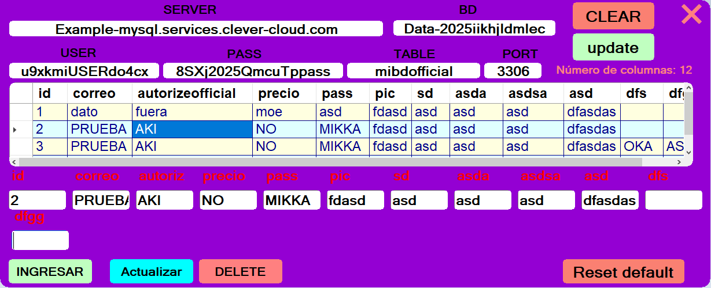

# MultiGenerador-BD-Global-MYSQL
Puedes gestionar tus LISTA de base de datos local (offline 100%) o de servidor (requisito internet para su uso de consumo de informacion) . soporta todo tipo de consultas de inmediato  

## PRUEBA

Este es el software de instalador, no requiere de ninguna instalación extra.

Puede ingresar tus datos ya sea local o del servidor como pruebas

puedes seleccionar cualquier columna de la base de datos y se te autogenera una lista de peticiones para trabajar, puedes agregar más a la lista, modificar o eliminar la fila de la base seleccionada

puedes restablecer la configuracion por defaul

 
  
## COPYRIGHT
PizzaEX Official 2025

## UnInstallation
no se requiere de ninguna desistalación ya que es una dependencia incrustada. no requiere de permisos administrador ni instalación adicional.

## EXTRA
Es un software ideal para practicas y correciones en pruebas para consultas, consumo de información. control de sistema, verificación de datos, validación,etc. excelente para principiantes y avanzados
